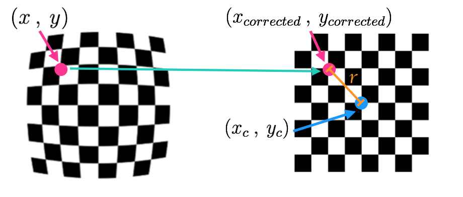
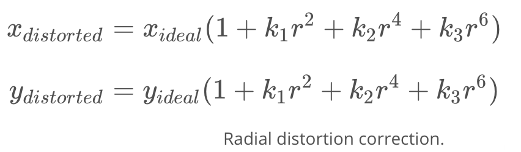
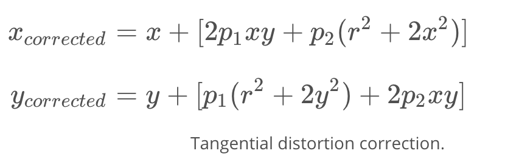

# Computer Vision, Deep learning and Sensor Fusion
-

## Computer Vision Fundamentals

## Camera Calibration

### Pinhole Camera Model

**Types of Distortion**

Real cameras use curved lenses to form an image, and light rays often bend a little too much or too little at the edges of these lenses. This creates an effect that distorts the edges of images, so that lines or objects appear more or less curved than they actually are. This is called radial distortion, and it’s the most common type of distortion.

Another type of distortion, is tangential distortion. This occurs when a camera’s lens is not aligned perfectly parallel to the imaging plane, where the camera film or sensor is. This makes an image look tilted so that some objects appear farther away or closer than they actually are.

**Distortion Coefficients and Correction**

There are three coefficients needed to correct for radial distortion: k1, k2, and k3. To correct the appearance of radially distorted points in an image, one can use a correction formula.

In the following equations, (x, y)(x,y) is a point in a distorted image. To undistort these points, OpenCV calculates r, which is the known distance between a point in an undistorted (corrected) image (xcorrected, ycorrected)(xcorrected, ycorrected) and the center of the image distortion, which is often the center of that image (xc, yc)(xc, yc). This center point (xc, yc)(xc, yc) is sometimes referred to as the distortion center. These points are pictured below.

Note: The distortion coefficient k3 is required to accurately reflect major radial distortion (like in wide angle lenses). However, for minor radial distortion, which most regular camera lenses have, k3 has a value close to or equal to zero and is negligible. So, in OpenCV, you can choose to ignore this coefficient; this is why it appears at the end of the distortion values array: [k1, k2, p1, p2, k3]. In this course, we will use it in all calibration calculations so that our calculations apply to a wider variety of lenses (wider, like wide angle, haha) and can correct for both minor and major radial distortion.

Points in a distorted and undistorted (corrected) image. The point (x, y) is a single point in a distorted image and (xcorrected, ycorrected) is where that point will appear in the undistorted (corrected) image.

There are two more coefficients that account for **tangential distortion**: **p1 **and **p2**, and this distortion can be corrected using a different correction formula.

